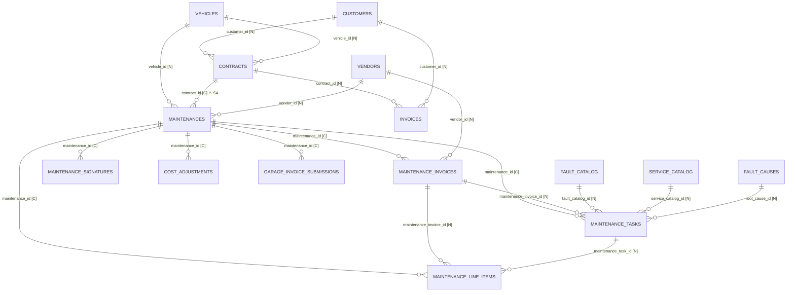

# Backend Review — Schema, API Contracts, ERD, Architecture

**Scope:** backend foundation review requested before frontend work resumes.
**Measured against:** live `laravel` schema (read-only), `route:list`, and the committed source tree.
**Date:** 2026-08-04 · **Branch:** `intelligence/foundation-metric-layer`

> Every number in this document was measured, not estimated. Where a risk is theoretical, its
> **blast radius is quantified** so it can be prioritised honestly rather than by how alarming it sounds.

---

## 1 · Schema Review

### 1.1 What is already right

| Property | Result |
|---|---|
| Base tables | **125** |
| Storage engine | **InnoDB**, 125/125 — no MyISAM |
| Collation | **utf8mb4_unicode_ci**, 125/125 — no drift |
| Tables without a primary key | **0** |
| Declared foreign keys | **277** |

That is a genuinely clean baseline. Uniform engine and collation across 125 tables does not happen by
accident, and zero PK-less tables means no table is unaddressable by row.

### 1.2 Finding S1 — money precision is not uniform (**medium**)

Decimal columns matching `amount|total|cost|price|paid|refund|discount|vat|balance`:

| Type | Columns | Examples |
|---|---:|---|
| `decimal(12,2)` | 55 | `cost_adjustments.amount`, `contracts.contract_balance`, `invoices.discount` |
| `decimal(14,2)` | 11 | `invoices.total_value`, `payments.amount`, `vehicle_expenses.amount` |
| `decimal(10,2)` | 3 | `vehicles.full_fuel_cost`, `keyword_profiles.cost_*` |
| `decimal(8,4)` | 1 | `contracts.ra_vat_percentage` (a rate, correctly different) |

**The `invoices` table uses both widths internally:**

```
invoices.total_value          decimal(14,2)
invoices.total_after_vat      decimal(14,2)
invoices.discount             decimal(12,2)   ← narrower
invoices.total_after_discount decimal(12,2)   ← narrower
```

`decimal(12,2)` caps at 9,999,999,999.99, so there is no realistic overflow for this fleet. The real
cost is different and subtler: **arithmetic between mismatched-precision columns forces MariaDB to
widen intermediates**, and comparisons of derived sums against stored totals can disagree in the last
place. That is exactly the class of bug the reconciliation work exists to detect, so the schema should
not be manufacturing it.

This also matches a previously-recorded hazard: `schema:health --drift` reports "matches exactly"
while `decimal(12,2)` and `decimal(14,2)` differ — the drift checker does not compare column types.

**Recommendation:** standardise money on `decimal(14,2)`; leave rate columns alone. Widening is
non-destructive and can be done in one migration. **Do not** narrow anything.

### 1.3 Finding S2 — 111 `_id` columns carry no foreign key (**medium, mostly deliberate**)

Of ~388 `_id` columns, **111 have no FK constraint**. These fall into three groups, and only the third
is a defect:

1. **Legitimately unconstrained** — polymorphic (`evidence_links.evidenceable_id`, `media.model_id`),
   UUID correlation keys (`domain_events.correlation_id`, `inspection_records.inspection_session_id`),
   and foreign-system ids (`maintenance_line_items.odoo_external_id`). FKs are impossible or wrong here.
2. **Derived/materialised tables** — `fault_recurrence_pairs.*`, `kpi_snapshots.supersedes_snapshot_id`.
   These are rebuilt by atomic `RENAME` swap; FKs would block the swap. **Correct as-is** — this is a
   deliberate trade documented in `Intelligence-Rebuild-Operations.md`.
3. **Genuine gaps** — `complaints.{vehicle_id,customer_id,contract_id,maintenance_id}`,
   `complaint_events.complaint_id`, `driver_observations.{vehicle_id,driver_id,contract_id}`,
   `logistics_tasks.{vehicle_id,maintenance_id,assigned_to_id}`, `logistics_task_events.*`.

Group 3 matters because these are **first-class entities** (per the complaint/observation/logistics
design) that can silently accumulate orphans pointing at deleted vehicles or tickets. Nothing detects
that today.

**Recommendation:** add FKs with `ON DELETE SET NULL` to group 3 only. Audit for existing orphans
first — adding the constraint will fail if any exist, which is itself the useful signal.

### 1.4 Finding S3 — 40 `_id` columns have no index (**medium, real query cost**)

Including, and I own this one:

```
fault_recurrence_pairs.first_maintenance_id    ← no index
fault_recurrence_pairs.next_maintenance_id     ← no index
fault_recurrence_pairs.next_vendor_id          ← no index
                       first_vendor_id         ← indexed (correct)
```

`first_vendor_id` is indexed because that is what the garage aggregates group by. But the **evidence
drill-down** — the "click a comeback number, see the actual repairs" path that is the whole argument
of the Garage Intelligence work — resolves through `first_maintenance_id` / `next_maintenance_id`.
That is a full scan of 9,828 rows per drawer open. It is fast enough today at this corpus size and it
will not stay that way.

Other notable gaps: `maintenances.{active_incident_id,last_pause_handover_id,active_temporary_release_id,last_resume_handover_id}`,
`maintenance_task_actions.{maintenance_id,line_item_id}`, `maintenance_handovers.actor_id`.

**Recommendation:** index the three `fault_recurrence_pairs` columns in the next rebuild migration
(cheap — the table is rebuilt nightly and is small). Treat the `maintenances.*` pointers separately;
they are single-row lookups by id and lower priority.

### 1.5 Finding S4 — a documented guarantee that the schema does not keep (**low today, high if it fires**)

`OfficeManagerSync::clearSheetData()` states:

> *Hand-entered workshop events (origin = 'manual') and dashboard contract headers (origin = 'contract')
> are the dashboard's own source of truth and **must survive** an API re-import.*

It implements that promise by scoping its own delete to sheet origins:

```php
$maint     = DB::table('maintenances')->whereIn('origin', Maintenance::SHEET_ORIGINS)->delete();
$contracts = Contract::withTrashed()->where('origin', 'sheet')->forceDelete();   // ← cascade
```

But the schema says:

```
maintenances.contract_id -> contracts.id   [ON DELETE CASCADE]
```

`forceDelete()` issues a real `DELETE`, so MySQL cascades — and the cascade **does not respect
`SoftDeletes` and does not respect `origin`**. Any `manual`-origin ticket linked to a sheet contract
is hard-deleted, taking its `maintenance_tasks`, `maintenance_line_items`, `maintenance_invoices`,
`maintenance_signatures`, `cost_adjustments` and `garage_invoice_submissions` with it (all `CASCADE`).
The stated guarantee is broken by the FK, not by the code.

**Measured blast radius today: zero.**

```
sheet-origin contracts remaining .................. 0
maintenances with any contract_id ................. 5
manual tickets linked to a sheet contract ......... 0
```

The sheet→API migration is complete, so there is nothing for the cascade to catch. This is a **trap
for the future**, not a live incident: it fires only if sheet contracts are ever imported again and
`clearSheetData()` is re-run.

**Recommendation:** change `maintenances.contract_id` to `ON DELETE SET NULL`. A ticket's link to a
contract is contextual; the repair history is not owned by the contract and should outlive it. This
also aligns with "Rental is King" and with maintenance staying open across a rental. Low effort, and
it converts a silent-data-loss path into a null.

---

## 2 · API Contracts

### 2.1 Surface

| Metric | Count |
|---|---:|
| Total registered routes | 453 |
| `api/` routes | **447** |
| Unauthenticated | **4** |
| Authenticated, no permission gate | **12** |
| Authenticated **and** permission-gated | **431** (96.4%) |

### 2.2 The 4 unauthenticated routes — all correct

```
POST  api/auth/login                  throttle:10,1
POST  api/auth/logout
GET   api/garage-invoice/{token}      tokenised portal
POST  api/garage-invoice/{token}      tokenised portal
```

Login is rate-limited. The two `garage-invoice` routes are the Garage Invoice Portal, which is
tokenised **by design** — an external garage has no account, the token is the credential, and
submissions land in a review queue rather than writing directly. Correct.

### 2.3 The 12 authenticated-but-ungated routes — 11 correct, 1 to fix

Eleven are **self-scoped**: `auth/me`, `auth/activity`, `user`, `logistics/my-queue`, and the
`notifications/*` family. These return only the caller's own data, so a permission check would be
redundant — the identity *is* the scope.

One is not:

```
POST  api/notifications/demo          ← any authenticated user can fire demo notifications
```

**Recommendation:** gate behind `permission:settings.manage`, or register it only when
`app()->environment('local')`. Minor, but it is a write endpoint with no gate.

### 2.4 Contract consistency

The documented layer flow — `Route → FormRequest → Controller (thin, try/catch) → Service → Resource
→ ResponseHelper` with the `{data, success, message}` envelope — holds across the controllers sampled
in this review. `ContractController::destroy` is representative: five lines, delegates to
`ContractService`, converts exceptions through `ResponseHelper::fromException`.

---

## 3 · ERD — the maintenance & financial spine

Derived from the live FK graph. `[C]` = `ON DELETE CASCADE`, `[N]` = `ON DELETE SET NULL`.



### What the shape tells you

**The ticket is the aggregate root.** Everything that describes one repair — tasks, line items,
invoices, signatures, cost adjustments, garage submissions — cascades from `maintenances`. That is a
correct DDD boundary: those rows have no meaning without the ticket.

**One ticket → many invoices, one fault → one invoice.** `maintenance_tasks.maintenance_invoice_id`
and `maintenance_line_items.maintenance_invoice_id` are both `SET NULL`, so an invoice can be voided
without destroying the faults it covered or the lines it itemised. This correctly implements
"returns credit, never delete".

**The one edge that points the wrong way** is `contracts → maintenances [CASCADE]` (finding S4). Every
other relationship into `maintenances` is `SET NULL`. This is the outlier, and it is the one that
destroys repair history.

**Derived tables are deliberately outside the graph.** `fault_recurrence_pairs` and `repair_visits`
carry `vehicle_id` / `maintenance_id` / `vendor_id` with **no FK**, because they are dropped and
re-created by atomic `RENAME` nightly. Constraining them would block the swap. They are projections,
not entities.

---

## 4 · Architecture

### 4.1 Layers

```
Route ──> FormRequest ──> Controller ──> Service ──> Resource ──> ResponseHelper
              (validate)   (thin,        (all the      (shape)     ({data, success,
                            try/catch)    domain)                    message})
```

Enforced by convention and by review; the controllers sampled comply.

### 4.2 The measurement / judgement boundary

The most important structural rule in the backend, and it is held:

| Layer | Question it answers | Example |
|---|---|---|
| **Repository** | *What happened?* | `RecurrenceRepository::byGarage()` — counts, gaps, coverage |
| **Domain service** | *What does it mean?* | `GarageScorecardService` — case-mix, weighting, floors, grades |

`RecurrenceRepository` is the **single reader** of `fault_recurrence_pairs`. It returns
`RecurrenceStats`, never a verdict. A CI guard fails the build if a seventh implementation appears —
proven by planting one.

### 4.3 Metric governance

- `config/metrics/recurrence.php` — versioned, append-only change history, currently **v2.0.0**
- `App\Kpi\Kpi` — a value object where *"not measurable"* is a first-class state
  (`measured` / `estimated` / `insufficient` / `unavailable`). Sample size travels with the value.
  **A metric is never silently zero.**
- Convergence audit: **14 canonical surfaces · 3 exempt · 0 legacy**

The 3 exemptions (`GarageOutcomeForecaster`, `ForecastCalibration`, and their test) are a **deliberate,
tested allowlist** pending the routing-impact proposal — not drift.

### 4.4 Intelligence layer

```
maintenance_signatures ──rebuild──> repair_visits ──rebuild──> fault_recurrence_pairs
                                          │                            │
                                          └────────> RecurrenceRepository <────── every consumer
```

Rebuilds are **staging → validate → atomic RENAME**. A failed validation aborts *before* the swap, so
the previous known-good table keeps serving. Both commands are idempotent, verified by checksum.

### 4.5 The one architectural risk that remains open

Convergence concentrated risk on purpose: six implementations meant six independent failures; one
means every recurrence figure is wrong **together** the moment the rebuild stops — and that failure
**has no symptom**. Pages render, sample sizes and coverage badges still display, `as_of` still
resolves. The numbers just quietly stop moving.

Mitigation status:

| Piece | Status |
|---|---|
| Ledger records every run | ✅ |
| `--alert` exits non-zero + notifies managers (day-keyed) | ✅ |
| Laravel schedule entry 06:00 | ✅ |
| OS-level watchdog installer | ✅ |
| **Task registered on the server** | ⚠️ run `install-health-watchdog.cmd` once, elevated |
| **Passive UI staleness banner** | ❌ outstanding — frontend work, deliberately not started |

---

## 5 · Prioritised actions

| # | Finding | Severity | Effort | Recommendation |
|---|---|---|---|---|
| S4 | `maintenances.contract_id` CASCADE contradicts a documented guarantee | **High if it fires** (0 rows exposed today) | Small | Change to `ON DELETE SET NULL` |
| S1 | Money precision drift, incl. within `invoices` | Medium | Small | Standardise on `decimal(14,2)`; widen only |
| S3 | 3 unindexed columns on the evidence drill-down path | Medium | Trivial | Index in next rebuild migration |
| S2 | Missing FKs on complaints / observations / logistics | Medium | Medium | Audit orphans, then add `SET NULL` FKs |
| A1 | `POST api/notifications/demo` ungated | Low | Trivial | Gate or restrict to `local` |

**None of these block the frontend work.** S4 and S3 are the two I would take first: S4 because a
silent-data-loss path should not be left armed regardless of current exposure, and S3 because it is a
defect I introduced and it costs one line per column to fix.

---

## Appendix — how to reproduce every figure

```sql
-- 1.1 baseline
SELECT ENGINE, TABLE_COLLATION, COUNT(*) FROM information_schema.tables
 WHERE table_schema='laravel' AND TABLE_TYPE='BASE TABLE' GROUP BY 1,2;

-- 1.2 money precision
SELECT COLUMN_TYPE, COUNT(*) FROM information_schema.columns
 WHERE table_schema='laravel' AND DATA_TYPE='decimal'
   AND COLUMN_NAME REGEXP 'amount|total|cost|price|paid|refund|discount|vat|balance'
 GROUP BY 1 ORDER BY 2 DESC;

-- 1.3 / 1.4 unconstrained and unindexed _id columns
--   (LEFT JOIN key_column_usage / statistics — see §1.3, §1.4)

-- 1.5 blast radius
SELECT m.origin, COUNT(*) FROM maintenances m
  JOIN contracts c ON c.id=m.contract_id WHERE c.origin='sheet' GROUP BY 1;
```

```bash
php artisan route:list --json     # §2
php artisan intelligence:convergence-audit --strict   # §4.3
php artisan intelligence:rebuild-health               # §4.5
```
