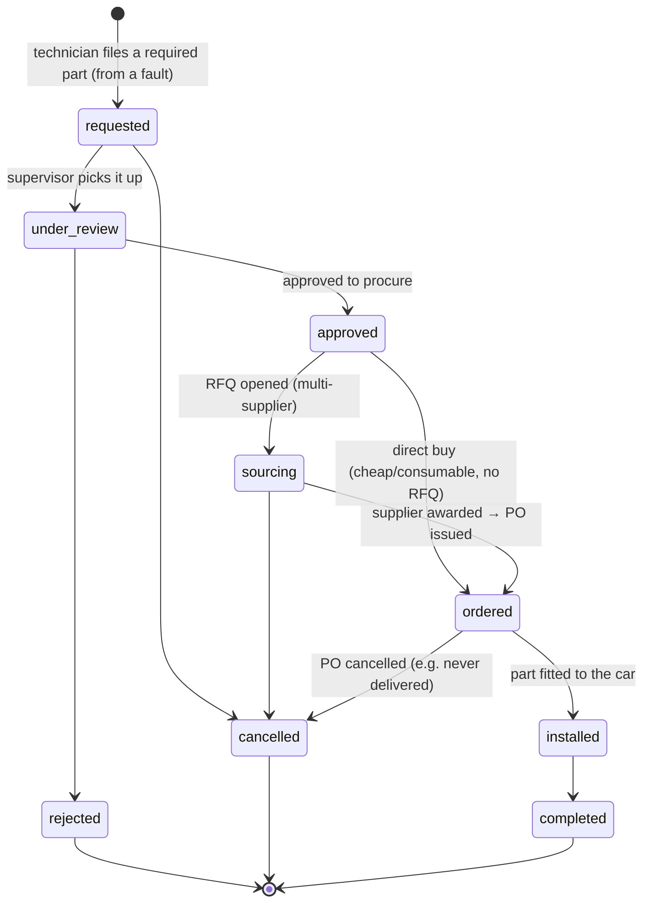
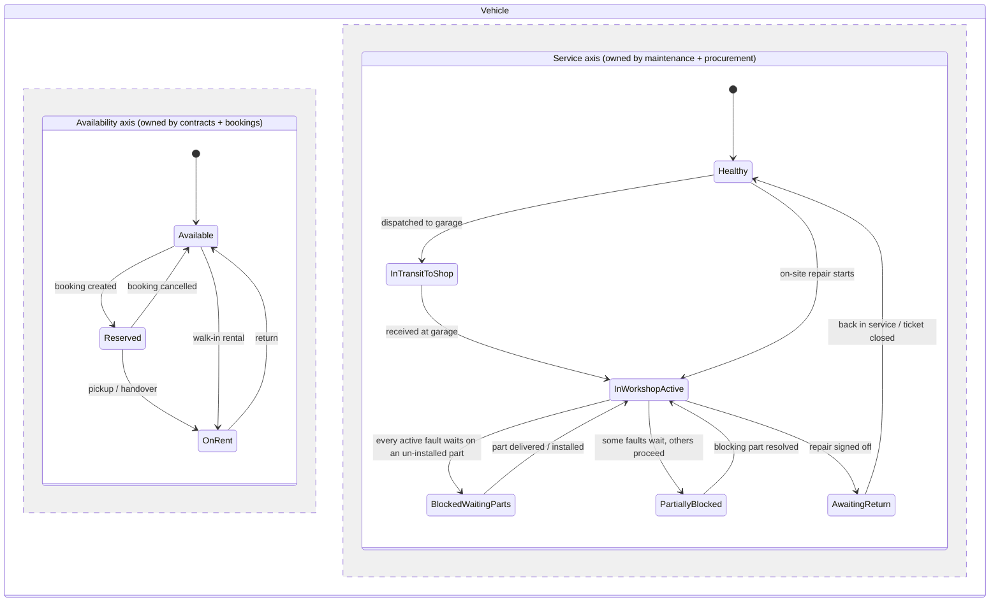
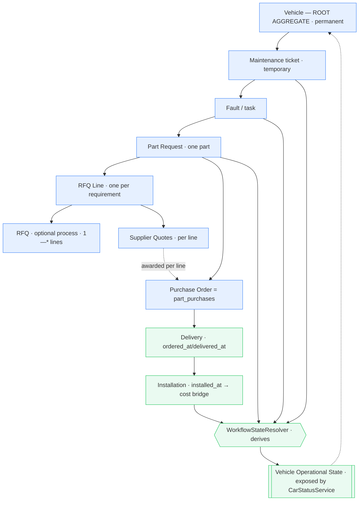
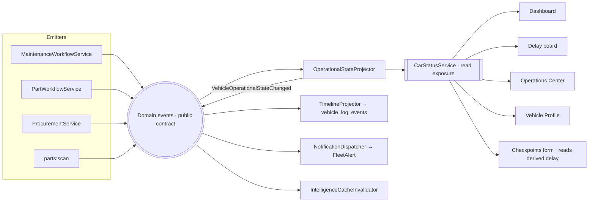
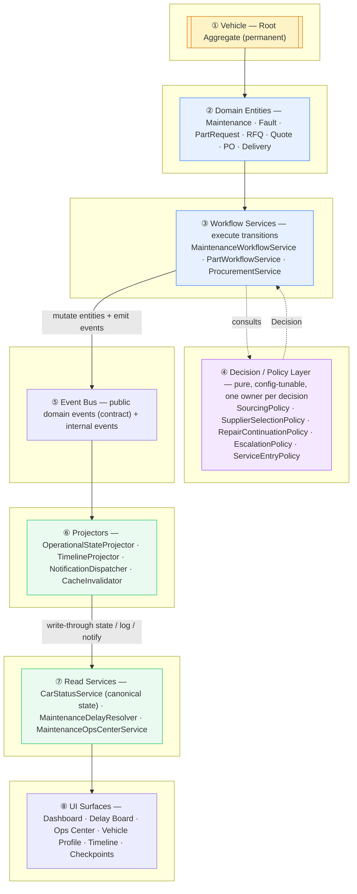

# Maintenance ⇄ Procurement — Connected Platform Architecture

**Status:** Proposal for agreement (architecture first, no code yet)
**Date:** 2026-07-26
**Author:** Claude (FleetView)

> Goal: turn Maintenance, Parts, Purchasing/RFQ, Checkpoints, Timeline, Notifications,
> Dashboard, Vehicle Profile, and the Operations Center into **different views of one
> operational process**. One action propagates everywhere. No fact is typed twice.
> Delay reasons are **inferred**, never entered. Vehicle status reflects reality.

---

## 0. Two principles that decide every downstream question

Everything below follows from separating two very different kinds of data. Conflating
them is the root cause of today's duplication.

**(A) Operational truth → SINGLE SOURCE, DERIVED ON READ.**
"Why is this car delayed?", "Is this repair blocked?", "What is the vehicle's real
status?", "Days waiting for the part?" — these are **never stored**. They are computed,
on demand, from the one authoritative record (the part's procurement state, the ticket's
lane, the fault's state). There is no second copy to fall out of sync, so there is nothing
to keep in sync. This is what kills the "type it in three places" problem.

**(B) Events & projections → PUSHED ON TRANSITION.**
"Something happened" (a PO was issued, a part was delivered, a repair resumed) is a
*fact in time*. When a workflow transition occurs, it **emits a domain event**. Listeners
project that event into the append-only timeline, fire notifications, and bust caches.
This is how modules "understand" each other **without any module owning another's truth**.

> Rule of thumb: if a page would *display* it → derive it. If it *happened* → emit an event.
> No page ever writes another domain's truth.

---

## 1. The entities and their Single Source of Truth

| Entity | Single Source of Truth (persisted) | Everything else about it is DERIVED |
|---|---|---|
| Repair lane position | `maintenances.workflow_status` | effective sub-state, vehicle operational status |
| Fault state | `maintenance_tasks.status` | "blocked / waiting for part X" |
| Part demand | `part_requests.status` | procurement sub-state (sourcing / awaiting delivery / received) |
| Sourcing | `part_rfqs` + `supplier_quotes` **(new)** | cheapest quote, selected supplier, comparison table |
| Purchase Order & fulfillment | `part_purchases` (extended) via `ordered_at / expected_delivery_date / delivered_at / installed_at` | awaiting-delivery vs received, ETA, days-waiting |
| Supplier | `vendors` (type `parts_supplier`) | avg delivery days, price history, reliability |
| Repair cost | `maintenance_line_items` (install bridge — unchanged) | ticket cost roll-up |
| **Delay reason** | **NONE — fully derived** | shown identically on every surface |
| Progress observation | `maintenance_checkpoints` | dashboard progress chips |
| Event history | `vehicle_log_events` (append-only) | vehicle timeline |
| Alerts | `notifications` | bell / counts |

Note the deliberate absence: **"delay reason" has no home table.** The moment it has one,
someone types into it and we are back to duplication.

---

## 2. The Part Lifecycle state machine (full, with RFQ)

This is the spine. `part_requests.status` is the **persisted demand state**; procurement
detail underneath `ordered` is **derived from timestamps**, not stored as separate statuses
(so there is no fulfillment status to desync).



### Derived procurement sub-state (never stored)

| Persisted `status` | Condition | Derived sub-state shown to users |
|---|---|---|
| `sourcing` | RFQ open, 0 quotes | **Awaiting quotes** |
| `sourcing` | RFQ open, ≥1 quote, none selected | **Comparing quotes** (N received) |
| `sourcing` | quote selected, PO not yet issued | **Supplier selected** |
| `ordered` | `delivered_at` null | **Awaiting delivery** · supplier · ETA · days-waiting |
| `ordered` | `delivered_at` set, `installed_at` null | **Received — ready to install** |
| `installed` | — | **Installed** |

This single mapping is the *only* place these labels are defined; every page reads it.

### Why RFQ is optional

You don't float an RFQ for a $5 oil filter. `approved → ordered` is the direct-buy path
(one supplier, immediate PO). `approved → sourcing → ordered` is the RFQ path. Same spine,
the workshop chooses per part.

---

## 3. Procurement model: RFQ, Quotes, PO — reuse vs new

### 3a. NEW — `part_rfqs` (the procurement process header)
An RFQ is a **procurement process**, not a single part. One RFQ covers **one or many** part
requirements via its lines. No direct part link at the header — the lines carry it.

| Column | Type | Meaning |
|---|---|---|
| `id` | pk | |
| `status` | string(16) | `open` → `partially_awarded` → `awarded` → `closed` / `cancelled` |
| `needed_by_date` | date null | when the workshop needs the parts |
| `notes` | text null | |
| `opened_by / _name / _at`, `closed_by / _name / _at` | audit | |

### 3b. NEW — `rfq_lines` (one line per part requirement)
The bridge that makes an RFQ single- **or** multi-part. Each line sources exactly one
requirement; award happens **per line**, so one RFQ can be split across suppliers.

| Column | Type | Meaning |
|---|---|---|
| `id` | pk | |
| `part_rfq_id` | FK → part_rfqs | the process this line belongs to |
| `part_request_id` | FK → part_requests | the requirement this line sources (1 line ↔ 1 requirement) |
| `quantity` | decimal(10,2) | needed on this line |
| `awarded_quote_id` | FK → supplier_quotes null | the winning bid **for this line** |
| `awarded_by / _name / _at` | audit | |

### 3c. NEW — `supplier_quotes` (a supplier's bid on a line)
Each supplier bids **per line**. Multi-supplier comparison lives here.

| Column | Type | Meaning |
|---|---|---|
| `id` | pk | |
| `rfq_line_id` | FK → rfq_lines | the specific required part being quoted |
| `vendor_id` | FK → vendors | the supplier |
| `unit_price`, `quantity`, `currency` | | the bid |
| `lead_time_days` **or** `expected_delivery_date` | | delivery promise → feeds the ETA |
| `status` | string(10) | `pending` (invited) → `submitted` → `selected` / `declined` |
| `notes`, `submitted_by / _name / _at` | | |

> One RFQ to three suppliers for two parts → up to 6 quotes, compared **line by line**.
> "Cheapest", "fastest", "best value" are **derived** from these rows at read time — not stored.

### 3d. REUSE + EXTEND — `part_purchases` becomes the Purchase Order & fulfillment record
The existing row already is the money event + cost bridge to `maintenance_line_items`.
We promote it to the **PO / delivery record** by adding a small set of columns:

| New column | Meaning |
|---|---|
| `rfq_line_id` (FK null) | which RFQ line this PO fulfils (null for direct buys) |
| `supplier_quote_id` (FK null) | the awarded quote this PO was issued against |
| `po_number` (string null) | human PO reference |
| `ordered_at` (datetime) | PO issued (was `purchased_at`; keep both or rename) |
| `expected_delivery_date` (date null) | **the ETA — source of "expected tomorrow"** |
| `delivered_at` (datetime null) | arrival at workshop → flips awaiting→received |

Fulfillment state (awaiting_delivery / received / installed) is **derived from
`ordered_at` / `delivered_at` / `installed_at`** — no new status column, nothing to desync.
"Days waiting" = `now − ordered_at` while `delivered_at` is null.

### 3e. REUSE — `vendors` as suppliers
Supplier = `vendors` row, `type = 'parts_supplier'`. Recommend un-commenting the dormant
`sla_days` (default lead time) and adding `default_lead_time_days` so a quote can pre-fill
an ETA and we can flag suppliers that beat/miss their SLA. Supplier performance
(avg delivery days, price history) is **derived** from `supplier_quotes` + `part_purchases`.

---

## 4. Repair blocked on parts — accuracy without desync

You asked for an accurate state ("the car is *not* actively under repair") **and** for
derived, non-duplicated truth. Both are achievable at once, and this is the key design call.

### The problem with a hand-written hold state
If we literally flip `workflow_status` to an `awaiting_parts` value on the active ticket,
we now hold the same fact in two places (the part is un-delivered **and** the ticket says
awaiting_parts). When the part arrives, something must remember to flip it back. That is
exactly the dual-write bug that creates "stale" data.

### The design: a first-class state whose *membership is computed*
The blocked state is **real and named** (so the vehicle status is accurate), but its truth
is **derived from the part lifecycle** (so there is nothing to keep in sync).

- `workflow_status` stays `under_repair` — that is the ticket's honest lane position
  ("this ticket is in the repair phase"). It is not overloaded.
- A **`WorkflowStateResolver`** computes, for any active ticket, an **effective operational
  state**:

```
effective_state(ticket):
    active_faults      = ticket.tasks where status in {pending, in_progress}
    blocking_parts     = part_requests linked to those faults
                         where status in {approved, sourcing, ordered}
                         and installed_at is null            # not yet fitted
    if active_faults is non-empty AND every active fault is blocked by such a part:
        → REPAIR_BLOCKED_AWAITING_PARTS
    else if some (not all) faults blocked:
        → UNDER_REPAIR_PARTIALLY_BLOCKED
    else:
        → UNDER_REPAIR_ACTIVE
```

- **Vehicle operational status** derives from this: a car whose repair is
  `REPAIR_BLOCKED_AWAITING_PARTS` displays **"Waiting for Parts"**, not "Under Repair".
  When the part's `delivered_at` is set, the resolver recomputes and the car is back to
  active repair **automatically** — no transition to remember, nothing to flip.

- **Fault-level blocking is also derived**: a fault is "Blocked — waiting for {part}" iff it
  has a linked, un-installed part request. No `blocked_reason` column is written.

This gives you the dedicated, accurate operational state you want, with zero dual-write.

> **Decision point D1** (see §10): accept the derived-named-state above (recommended), OR
> persist an explicit `under_repair_awaiting_parts` workflow value written on PO-issue and
> reverted on delivery. I recommend derived; I'll implement either.

---

## 5. The delay reason — 100% inferred

There is one resolver, `MaintenanceDelayResolver`, and it is the only definition of "why
delayed" in the system.

```
delay(ticket):
    if effective_state(ticket) in {BLOCKED_*}:
        parts = blocking_parts(ticket)
        return {
          reason:   "waiting_for_parts",            # enum, derived
          headline: "Waiting for " + parts[0].name, # "Waiting for Brake Pads"
          supplier: awarded_supplier(parts[0]),      # from supplier_quotes / part_purchases
          eta:      parts[0].expected_delivery_date, # "Tomorrow"
          days_waiting: now - parts[0].ordered_at,   # "5"
          blocking_parts: [...]                       # full list for the drawer
        }
    if ticket has newly-opened faults after repair start:
        return { reason: "additional_damage", ... }   # derived from fault timestamps
    # genuinely manual reasons fall through to the latest checkpoint override:
    return checkpoint_manual_reason(ticket)            # workshop_busy / customer_approval / insurance_approval
```

**Checkpoint delay reasons shrink.** Today the enum has `waiting_parts`, `vendor_delay`,
`additional_damage` — all now **derived** and therefore **removed from the manual picker**.
What remains manual is only what the system genuinely cannot know: `workshop_busy`,
`customer_approval`, `insurance_approval`, `other`. The technician can no longer type
"waiting for parts" — the system already knows, and if they disagree the fix is to update
the *part record* (the SSoT), which the checkpoint form will let them do (see §7).

---

## 6. Event flow — how modules talk without owning each other

The codebase today has **no event bus**; it uses direct service injection. We introduce a
**thin domain-event layer** using Laravel's built-in events (zero new dependencies) — but
**only for projections and side-effects**, never for operational truth (that stays derived).

### Domain events (emitted by the workflow/procurement services on transition)

| Event | Emitted when |
|---|---|
| `PartRequirementRaised` | technician files a part need on a fault |
| `PartRequestApproved` / `Rejected` | supervisor decision |
| `RfqOpened` | RFQ floated to suppliers |
| `QuoteSubmitted` | a supplier's bid recorded |
| `SupplierAwarded` | winning quote selected |
| `PurchaseOrderIssued` | PO created (`ordered_at` set, ETA known) |
| `PartDeliveryDelayed` | ETA passed / pushed back |
| `PartDelivered` | `delivered_at` set |
| `PartInstalled` | fitted (`installed_at` set) |
| `RepairBlockedOnParts` / `RepairResumed` | effective_state crosses the blocked boundary |

### Listeners (each is one module "subscribing" to the platform)

| Listener | Reacts by |
|---|---|
| `TimelineProjector` | append a `vehicle_log_events` row (reuses `VehicleLogService`) |
| `NotificationDispatcher` | fire `FleetAlert` to the right roles (reuses `NotificationScanner`) |
| `IntelligenceCacheInvalidator` | bust `intelligence:maintenance_ops:*`, dashboard caches |
| `CheckpointReconciler` (optional) | auto-note "part received" on the ticket's progress |

```
Supervisor awards supplier
        │  ProcurementService.award()  (writes supplier_quotes.selected, part_rfqs.awarded)
        ▼
   emit SupplierAwarded ──▶ TimelineProjector      → "Supplier A selected (cheaper)"
                       └──▶ NotificationDispatcher  → buyer + supervisor
Buyer issues PO
        │  ProcurementService.issuePO() (part_purchases.ordered_at + expected_delivery_date)
        ▼
   emit PurchaseOrderIssued ──▶ Timeline            → "PO #123 · ETA tomorrow"
                            ├──▶ Notifications        → "Ordered, awaiting delivery"
                            └──▶ CacheInvalidator     → ops-center recomputes
        ▼ (nothing writes the ticket — resolver now DERIVES it as blocked)
   Dashboard / Delay board / Vehicle status / Ops Center  ← all recompute from parts
```

The workflow service emits **one** event; it does not know or care who listens. Add a new
consumer later (a report, a Slack push) by registering a listener — no change to the emitter.
That is the "every workflow understands every other workflow" property, made concrete.

> This is the one **new architectural primitive** (`app/Events` + `app/Listeners` +
> `EventServiceProvider`). Everything else is reuse. **Decision point D2** (§10): adopt the
> Laravel event layer (recommended), or keep today's direct-call style and just centralize
> the projection calls in the two workflow services. I recommend the event layer — it is the
> difference between "connected" and "still coupled."

---

## 7. Checkpoints become an *input* to the part lifecycle, not a parallel store

When the resolver already knows a ticket is blocked on a part, the checkpoint form changes:

- It **does not ask** the technician to pick a delay reason — it shows the derived one,
  read-only: *"Delay: Waiting for Brake Pads · Supplier A · ETA tomorrow · 5 days."*
- Instead it asks the **part-specific question** and writes to the **part record (SSoT)**:
  - *Did the part arrive?* → Yes sets `part_purchases.delivered_at` (emits `PartDelivered`,
    which auto-unblocks the repair).
  - *If not, new ETA?* → updates `expected_delivery_date` (emits `PartDeliveryDelayed`).
  - *Alternative supplier?* → opens/adjusts the RFQ.

So the checkpoint stops being a place to *retype* the delay and becomes a place to *advance*
the procurement truth. One action, propagated everywhere.

---

## 8. Every surface, same derived truth

| Surface | Today | After |
|---|---|---|
| Maintenance Delay board | manual `delay_reason` per checkpoint | `MaintenanceDelayResolver` (waiting-for-part, supplier, ETA, days) |
| Vehicle operational status | "Under Repair" even when stalled | "Waiting for Parts" when `effective_state` is blocked |
| Dashboard KPIs | counts only | clickable: *Cars Waiting for Parts / PRs Pending / Supplier Delays / Parts Ordered / Ready-once-arrives* — each a derived query, drill-down to the list |
| Vehicle Timeline | part_* events already show | + `rfq_opened / quote_received / supplier_awarded / po_issued / delivery_delayed / part_delivered / repair_blocked / repair_resumed` |
| Notifications | duplicates only | + supplier-accepted, delivery-delayed, part-received, repair-resumed, blocked-waiting-parts, checkpoint-overdue-while-waiting |
| Ops Center | reads `WF_AWAITING_PARTS` (pre-ticket only) | reads `effective_state` incl. active-ticket block; "Waiting for Parts" action already exists |
| Checkpoints | manual "waiting_parts" | derived + part-advancing questions |

Dashboard KPI derivations (all one-line queries over the SSoT, zero new storage):
- **Cars Waiting for Parts** = tickets whose `effective_state ∈ {BLOCKED_*}`.
- **Purchase Requests Pending** = `part_requests.status ∈ {requested, under_review, approved, sourcing}`.
- **Supplier Delays** = `part_purchases` where `delivered_at` null and `expected_delivery_date < today`.
- **Parts Ordered** = `part_purchases` where `delivered_at` null.
- **Ready once parts arrive** = blocked tickets whose only blocker is an already-`delivered`, not-yet-`installed` part.

---

## 9. Reuse ledger (what we do NOT rebuild)

- `part_requests`, `part_purchases`, `part_investigations` — extended, not replaced.
- `PartWorkflowService` — becomes an event emitter; keeps its transaction/locking logic.
- `vendors` — is the supplier table (+ 1–2 dormant columns revived).
- `VehicleLogService` — stays the canonical timeline writer (called from `TimelineProjector`).
- `NotificationScanner` / `FleetAlert` — stays the delivery mechanism (called from
  `NotificationDispatcher`) + a new `partsAwaitingDelivery` / `supplierDelay` scan detector.
- `MaintenanceOpsCenterService`, `MaintenanceForecastService`, `MaintenanceForesightService`,
  `MaintenanceCheckpointService`, `ServiceDueSnooze` — all read the new derived state; none rewritten.
- `ActivityFeedService` — add labels/categories for the new procurement event types
  (parts events are currently second-class; promote them).
- Explainability engine — register a `PartDelayExplainer` so every "Waiting for Parts"
  number traces to its RFQ/PO/quote.

**New tables:** `part_rfqs`, `supplier_quotes`. **New columns:** ~6 on `part_purchases`,
1–2 on `vendors`. **New services:** `ProcurementService`, `WorkflowStateResolver`,
`MaintenanceDelayResolver`. **New primitive:** `app/Events` + `app/Listeners`.
That is the entire net-new footprint.

---

## 10. Decisions to lock before implementation

- **D1 — Blocked repair representation:** derived first-class state (`effective_state`,
  recommended) vs. persisted `under_repair_awaiting_parts` workflow_status. *Recommend derived.*
- **D2 — Event layer:** adopt Laravel events/listeners for projections (recommended) vs.
  keep direct calls centralized in the two services. *Recommend event layer.*
- **D3 — RFQ granularity:** one RFQ per part requirement (recommended, simplest, per-car
  auditable) vs. one RFQ batching many parts for a car. *Recommend one-per-requirement now;
  batching can layer on later without schema change to `supplier_quotes`.*
- **D4 — Cost timing:** cost still bridges to `maintenance_line_items` at **install**
  (unchanged) — confirm you don't want cost recognized at PO/delivery instead.
- **D5 — Rollout:** single connected build (RFQ + derivation + block state together) vs.
  phased (derivation + block state first, RFQ second). You've signaled you want the full
  lifecycle — I'll assume **single connected build** unless you say phase it.

---

## 11. Implementation order (once D1–D5 are agreed)

1. Schema: `part_rfqs`, `supplier_quotes`, `part_purchases` columns, `vendors` columns.
2. `part_requests` status machine extension (`sourcing`, guarded transitions).
3. `ProcurementService` (open RFQ → record quotes → award → issue PO → mark delivered).
4. `WorkflowStateResolver` + `MaintenanceDelayResolver` (the derivation core).
5. `app/Events` + `app/Listeners` + `EventServiceProvider`; wire emitters in
   `PartWorkflowService` / `ProcurementService` / `MaintenanceWorkflowService`.
6. Projection listeners: timeline, notifications, cache-invalidation (reuse existing services).
7. Checkpoint form: derived delay + part-advancing questions.
8. Read surfaces: delay board, dashboard KPIs (clickable), Ops Center, vehicle status,
   timeline labels, notification detectors.
9. RFQ/quote-comparison UI + PO/delivery UI on the Parts board and the ticket drawer.
10. Explainability: `PartDelayExplainer`.

Each step is behind the derivation core, so the platform stays consistent at every commit.

---

# Addendum A — Architectural resolutions (review round 1)

These resolve the review checklist: SSoT with no competing interpretations, "Waiting for
Parts" as a condition not a state, one canonical operational service, deterministic triggers,
future-scenario resilience, and one authoritative owner per business rule. Where this
addendum and §1–§11 differ, **this addendum wins** (it is the refined position).

## A1. The three — and only three — persisted truths

Everything operational is a pure function of these. Nothing else stores operational state.

| # | Persisted truth | Table | Owns the answer to |
|---|---|---|---|
| 1 | Maintenance **lane** | `maintenances.workflow_status` | "which phase of the repair process is this ticket in?" |
| 2 | **Fault** state | `maintenance_tasks.status` | "is this specific defect open / done / cancelled?" |
| 3 | **Procurement** state | `part_requests.status` + `part_purchases` timestamps + `part_rfqs`/`supplier_quotes` | "where is each required part in sourcing → delivery → install?" |

**Retired as sources of operational truth:** any UI-derived status, and the *maintenance
interpretation* of the written `operational_status` column (see A3). Cost is unchanged
(`maintenance_line_items` via install bridge).

## A2. "Waiting for Parts" is a derived condition, not a state

It is **never** a value of `workflow_status`. It is computed:

```
waiting_for_parts(ticket) ==
    lane(ticket) is an in-repair lane
    AND active_faults(ticket) is non-empty
    AND every active fault has a linked part_request that is not yet installed
```

Because it is a function, there is no transition to manage and nothing to desync. The
existing pre-ticket `WF_AWAITING_PARTS` value keeps a **different, non-overlapping** meaning
and gets a **different label** to remove ambiguity:

| Concept | Source | User-facing label |
|---|---|---|
| Pre-ticket, approved, spare not in hand yet, repair not started | `workflow_status = awaiting_parts` (recommendation queue) | **"Approved — awaiting spare to start"** |
| Mid-repair, work halted because a required part is un-delivered | derived condition (A2) | **"Repair blocked — waiting for parts"** |

## A3. `effective_state` is the ONE canonical operational interpretation, exposed by `CarStatusService`

```
        maintenances.workflow_status ─┐
        maintenance_tasks.status ─────┼──▶ WorkflowStateResolver ──▶ effective_state
        part_requests + PO timestamps ┘        (pure function, the ONLY definition)
                                                        │
                                                        ▼
                                            CarStatusService  ← the ONE exposure point
                                                        │
        ┌───────────────┬───────────────┬───────────────┼───────────────┬───────────────┐
     Dashboard     Delay board     Ops Center       Timeline      Vehicle Profile   Notifications
        (all CONSUME effective_state; NONE recompute it)
```

- `effective_state` values: `active_repair`, `repair_blocked_waiting_parts`,
  `partially_blocked`, plus the existing non-repair operational states.
- **`WorkflowStateResolver`** is the sole author of the derivation. **`CarStatusService`** is
  the sole exposure surface. No controller, page, job, or other service re-derives it.
- **Reconciliation of the legacy `operational_status` column and
  `OperationsService::vehiclesInMaintenance()`:** the column, if kept, becomes a
  **write-through projection** whose *only* writer is the resolver's event listener (for
  fast SQL filtering); it is never written by controllers or UI and is never read as the
  source of truth. `vehiclesInMaintenance()` is refactored to delegate to the resolver so
  it cannot drift. One interpretation, one owner.

## A4. Deterministic triggers — how derived-condition events fire

A derived condition has no transition of its own, so its **events are triggered by the
persisted transitions that change its inputs**. This keeps every event explainable by one
deterministic trigger.

| Derived event | Deterministic trigger (a persisted transition) | Emit rule |
|---|---|---|
| `RepairBlockedOnParts` | `PurchaseOrderIssued`, `PartRequirementRaised`, or a fault reopened | after the trigger, resolver recomputes; emit **iff** `effective_state` crossed into `repair_blocked_waiting_parts` |
| `RepairResumed` | `PartDelivered` / `PartInstalled` / fault closed | emit **iff** `effective_state` crossed **out of** blocked |
| `PartDeliveryDelayed` | scheduled `parts:scan` finds `expected_delivery_date < today`, `delivered_at` null | emit once per crossing (idempotent key) |

Boundary-crossing is detected by comparing the resolver's result **before vs after** the
triggering transition, inside the same transaction — no polling of derived state, no stored
"last condition" needed for the synchronous path. (The scheduled scan covers the one
time-based trigger, delivery lateness, which has no user action to hang off.)

## A5. Future-scenario resilience (no core redesign required)

| Scenario | Handled by | Redesign? |
|---|---|---|
| **Multiple suppliers / multi-part RFQ** | `part_rfqs` 1—* `rfq_lines` 1—* `supplier_quotes`; award **per line** | none (core design) |
| **Multiple RFQs / mixed sourcing** | many `rfq_lines` may point at one `part_request` over time; lines split across suppliers | none |
| **Multiple POs per part** | `part_requests` 1—* `part_purchases` (already exists) | none |
| **Partial delivery / backorder** | quantity-level fulfillment: `part_purchases.ordered_qty` + `delivered_qty`; request is "received" only when Σ`delivered_qty` ≥ required; `effective_state` stays blocked until then | add 2 columns, no new table |
| **Supplier substitution** | select a different `supplier_quote` → new `part_purchases` (PO) against the same request; old PO → `cancelled` | none |
| **Staged repairs** | faults are independent; `partially_blocked` already models "some faults proceed while one waits" | none |
| **Supplier performance / SLA** | derived from `supplier_quotes.lead_time` vs `part_purchases.delivered_at` vs `vendors.default_lead_time_days` | none (pure derivation) |
| **Approval thresholds / budget gates** | a policy check in `ProcurementService` before award/PO — one owner, one place | none |

The only schema growth any of these forces is the partial-delivery quantity pair. Everything
else is quotes, POs, or derivation the model already supports.

## A6. Business Rule Ownership Map — one authoritative owner per rule

No business decision lives in a controller, page, or job. Each rule has exactly one owning
service; everything else consumes the result.

| Business rule / decision | Sole owner | Consumers (never re-implement) |
|---|---|---|
| Demand lifecycle transitions (request→approve→…→complete) + guards | `PartWorkflowService` | Parts UI, ticket drawer |
| Sourcing: open RFQ, record quotes, award, issue PO, mark delivered | `ProcurementService` | Parts UI, checkpoint form |
| Cost recognition (part → `maintenance_line_items` at install) | `PartWorkflowService` (install) | ticket cost roll-up |
| Duplicate / recurrence detection | `PartIntelligenceService` | investigations UI |
| Is a fault blocked? Is the repair blocked? `effective_state` | `WorkflowStateResolver` | `CarStatusService`, everyone downstream |
| The canonical operational status exposure | `CarStatusService` | Dashboard, Delay board, Ops Center, Timeline, Vehicle Profile |
| "Why delayed?" (reason, ETA, days-waiting) | `MaintenanceDelayResolver` | Delay board, drawer, checkpoint (read-only), reports |
| Maintenance priority score / recommended action | `MaintenanceOpsCenterService` (existing) | Ops Center board |
| Preventive service-due (km rule) | `Vehicle::serviceStatus()` / `MaintenanceForecastService` (existing) | Ops Center, notifications |
| What happened, when (event record) | `VehicleLogService` (via `TimelineProjector`) | Timeline, activity feed |
| Who gets alerted, for what | `NotificationDispatcher` + `NotificationScanner` | bell |
| Every figure's explanation/provenance | Explainability engine (`PartDelayExplainer`, existing engine) | any "why is this number here?" |

Rule of enforcement: **if a component needs an operational answer, it calls the owner. It
never computes its own version.** This is what makes the platform one interpretation instead
of many.

---

# Addendum B — Vehicle as the root aggregate (platform-level model)

Reframing from review round 2: the maintenance ticket, part request, RFQ, and PO are all
**temporary**. The **vehicle is permanent** and is the **root aggregate** everything serves.
The top-level state machine is therefore the **Vehicle Operational Lifecycle**; Maintenance,
Procurement, Logistics, Checkpoints, Forecasting, Timeline, Notifications, and the Operations
Center are **supporting workflows that influence the vehicle's operational state**, never
top-level entities in their own right.

## B1. The Vehicle Operational Lifecycle (top-level state machine)

The vehicle's operational state is **two orthogonal axes that are never collapsed into one
stored value** (consistent with the established dual-state, "never overwrite", Rental-is-King
design). Both axes are **derived** by `WorkflowStateResolver` from the three persisted truths
(A1) plus the rental/booking records; both are exposed together by `CarStatusService`.



**Both axes are always live and always shown** (never overwrite one with the other). A car
can be `OnRent` **and** `BlockedWaitingParts` simultaneously — that is real and must be
representable.

### Deterministic headline reduction (for compact surfaces only)

Some surfaces (a table cell, a KPI) need one label. The reduction is a **pure, deterministic
function** owned by `CarStatusService` — never re-implemented per page. Precedence:

| # | If … | Headline label |
|---|---|---|
| 1 | Service = `BlockedWaitingParts` and Availability ≠ `OnRent` | **Waiting for Parts** |
| 2 | Availability = `OnRent` (Rental is King) | **On Rent** *(+ badge "repair open / waiting parts" if service axis is active — never hidden)* |
| 3 | Service ∈ {`InWorkshopActive`,`PartiallyBlocked`,`InTransitToShop`,`AwaitingReturn`} | the service-axis label |
| 4 | otherwise | the availability-axis label |

The badge in rule 2 is how "never overwrite" survives the reduction: the headline is
compact, but the second axis is still surfaced, not lost.

### Supporting workflows → which axis each one moves

| Supporting workflow | Moves which axis | How |
|---|---|---|
| Contracts / Rentals | Availability | pickup → `OnRent`, return → `Available` |
| Bookings / Readiness | Availability | booking → `Reserved` |
| Maintenance Workflow | Service | lane transitions → `InWorkshop*` / `AwaitingReturn` |
| Procurement (parts/RFQ/PO) | Service | un-installed blocking parts → `BlockedWaitingParts` |
| Logistics Dispatch | Service | dispatch/return legs → `InTransitToShop` |
| Checkpoints | (none) | *observes*; advances part truth, never sets vehicle state directly |
| Forecasting / Foresight | (none) | *predicts*; produces risk, not operational state |
| Timeline / Notifications / Dashboard / Ops Center | (none) | *consume* the state; never set it |

The last row is the whole point: reporting and alerting surfaces **read** the vehicle state;
they never author it.

## B2. Event ownership — emitter, subscribers, public vs internal

Every event has exactly **one emitter**. **Public** events are the platform contract: stable
names, any service may subscribe. **Internal** events are one service's private mechanics:
no outside subscribers, may change without notice.

### Public platform events

| Event | Sole emitter | Subscribers |
|---|---|---|
| `FaultIdentified` | `MaintenanceTaskService` | Timeline, Notifications |
| `PartRequirementRaised` | `PartWorkflowService` | Timeline, Notifications, **OperationalStateProjector** |
| `PartRequestApproved` / `Rejected` | `PartWorkflowService` | Timeline, Notifications |
| `RfqOpened` | `ProcurementService` | Timeline, Notifications |
| `QuoteSubmitted` | `ProcurementService` | Timeline |
| `SupplierAwarded` | `ProcurementService` | Timeline, Notifications |
| `PurchaseOrderIssued` | `ProcurementService` | Timeline, Notifications, **OperationalStateProjector** |
| `PartDeliveryDelayed` | `parts:scan` command | Timeline, Notifications |
| `PartDelivered` | `ProcurementService` | Timeline, Notifications, **OperationalStateProjector** |
| `PartInstalled` | `PartWorkflowService` | Timeline, cost bridge, **OperationalStateProjector** |
| `MaintenanceLaneChanged` (dispatched/under_repair/ready/closed…) | `MaintenanceWorkflowService` | Timeline, Notifications, **OperationalStateProjector** |
| `RepairBlockedOnParts` / `RepairResumed` | **OperationalStateProjector** (on boundary cross) | Timeline, Notifications |
| **`VehicleOperationalStateChanged`** | **OperationalStateProjector** | Dashboard cache, Ops Center cache, Vehicle Profile, Forecast invalidation |

`VehicleOperationalStateChanged` is the **top-level platform event**: the single signal the
vehicle-centric surfaces care about. They subscribe to it and stay dumb about *why* it
changed. `OperationalStateProjector` is the thin listener that (a) recomputes
`effective_state` via `WorkflowStateResolver` after any input-changing event, (b) write-through
updates the denormalized `operational_status` column, and (c) emits the derived-condition
events and the top-level event when a boundary is crossed. It is the **only** writer of
derived operational state.

### Internal events (not the platform contract)

| Internal event | Owner (private) | Why internal |
|---|---|---|
| duplicate/recurrence flag raised | `PartIntelligenceService` | detection mechanics; only its own investigation flow reacts |
| checkpoint escalation level computed | `MaintenanceCheckpointService` | time-based reminder math; not a domain fact |
| intelligence cache key bumped | `IntelligenceCacheInvalidator` | infra concern, not business |

Guideline: an event is **public** only if a *different* concern legitimately needs to react
to it. Otherwise it stays internal, so the platform contract stays small and stable.

## B3. Diagrams for validation

### (a) Aggregate / data-dependency (containment) — the vehicle is the root



Blue = persisted aggregates (temporary except the root Vehicle). Green = derived. Cardinalities:
Vehicle 1—* Maintenance, ticket 1—* Fault, Fault 1—* PartRequest, PartRequest 1—{0,1} RFQ Line,
RFQ 1—* RFQ Line, RFQ Line 1—* SupplierQuote, PartRequest 1—* PurchaseOrder. Everything
ultimately rolls up to one derived Vehicle Operational State.

### (b) Event flow — how consumers subscribe



Note the two-hop pattern: granular events → `OperationalStateProjector` recomputes and emits
the **one** `VehicleOperationalStateChanged`; vehicle-centric surfaces read through
`CarStatusService` and never touch the granular events. Timeline/Notifications subscribe to
the granular events directly because they record *what happened*, not *the resulting state*.

## B4. What this means for the blueprint

- The document is now vehicle-rooted: the **Vehicle Operational Lifecycle (B1)** is the
  top-level machine; Maintenance/Procurement/etc. are supporting workflows that move one axis.
- There is one derived operational truth (`effective_state`, A3), one authoring listener
  (`OperationalStateProjector`, B2), one read exposure (`CarStatusService`), one owner per
  rule (A6), and one public event contract (B2) with a single top-level event
  (`VehicleOperationalStateChanged`).
- New primitive beyond Addendum A: `OperationalStateProjector` (the listener that turns
  granular events into the canonical vehicle state + top-level event). No new tables.

---

# Addendum C — The Decision / Policy Layer

Final concept from review round 3. A **transition** says *what happened*; an **event** says
*that it happened*; but neither says **why the platform decided to act**. Those "should we?"
questions are **business policy**, not workflow execution, and they must not leak into
controllers, services, jobs, or UI over time. This addendum gives every business decision a
single owner.

## C1. The principle: workflows execute, policies decide

```
Workflow Service:  "A part is needed. Should I open an RFQ or buy directly?"
        │  consults ▼
Policy (SourcingPolicy):  pure(inputs, config) → Decision{ mode: rfq | direct, rationale }
        │  returns ▲
Workflow Service:  executes the Decision (mutates entities, emits events)
```

A **Policy** is:
- **Single-question, single-owner** — it answers exactly one business question; nothing else
  in the platform answers that question.
- **Pure & deterministic** — output is a function of explicit inputs plus tunable `config/`.
  No DB writes, no event emission, no workflow calls, no clock/random reads passed implicitly
  (time/thresholds come in as inputs/config). Same inputs → same `Decision`, always testable.
- **Config-tunable** — thresholds and weightings live in `config/` (e.g.
  `config/procurement_policy.php`), so the business tunes behaviour without touching logic —
  matching the existing pattern (`config/parts_intelligence.php`, `config/severity_impact.php`).
- **Advisory or binding** (see C3).

A Policy is **not** a workflow, a validator, or a projector. Validators reject bad input;
policies choose between valid options.

## C2. The decision catalog (one owner each)

| Business decision | Policy owner | Key inputs | `Decision` output | Kind |
|---|---|---|---|---|
| Open an RFQ or buy directly? | `SourcingPolicy` | part_class, est. price, urgency, RFQ price threshold (config) | `rfq` \| `direct` | binding |
| Which supplier — cheapest / fastest / best value? | `SupplierSelectionPolicy` | quotes[], needed_by, price/lead-time weights (config) | recommended `quote_id` + ranking | **advisory** |
| Continue partial repair or stay fully blocked? | `RepairContinuationPolicy` | fault set, which faults blocked, severity, safety | `proceed_partial` \| `hold_all` | binding |
| Suggest an alternative / superseded part? | `AlternativePartPolicy` | part_number, availability, supersession map | suggestions[] | **advisory** |
| Escalate today or wait another day? | `EscalationPolicy` *(absorbs today's checkpoint escalation math)* | days_waiting, ETA, severity, SLA (config) | `none`\|`reminder`\|`due_today`\|`overdue` | binding |
| Leave service now or finish the current rental? | `ServiceEntryPolicy` *(absorbs eligibility + rental-eligibility flag)* | fault mandatory/deferrable, active rental, upcoming booking | `ground_now` \| `after_rental` | binding |

The italicised rows already exist as logic **scattered** across services today; the Policy
Layer is where they get pulled into one owner. `EscalationPolicy` becomes the sole source of
escalation levels — `CheckpointsScan` and the Ops Center both consult it instead of each
computing their own.

## C3. Advisory vs binding — and how binding decisions respect SSoT

- **Advisory policy** → produces a *recommendation* a human acts on. Nothing is persisted from
  the policy itself; the human's action flows through the normal workflow. (SSoT untouched.)
- **Binding policy** → its outcome changes future behaviour, so it must be reproducible. The
  workflow **persists the decision as a minimal input to derivation** (a small field or a
  `decision_log` row), never as duplicated state. Example: `RepairContinuationPolicy` →
  `hold_all` writes a `repair_hold_mode` flag on the ticket; `WorkflowStateResolver` then reads
  that flag when deriving `BlockedWaitingParts` vs `PartiallyBlocked`. The resolver still
  derives from persisted truth — the policy simply authored one more persisted input.

> This is the rule that keeps the Policy Layer from re-introducing scattered state: a binding
> decision persists **its choice** (one field / one log row), and derivation reads that choice.
> It never persists the *consequence* (which would duplicate what the resolver computes).

Optional `decision_log` (one table, append-only) records every binding decision —
`{ subject, policy, inputs_snapshot, decision, actor|system, at }` — giving full "why did the
platform do this?" auditability and feeding the Explainability engine. Recommended, not required
for v1.

## C4. The complete layering (where every responsibility lives)



**Call-direction rules (what makes the stack drift-proof):**
- Layers call **downward** for execution (① owns ②; ③ mutates ②) and **sideways-down** to
  consult ④. Policies (④) are a **leaf**: they read inputs + config and return a `Decision`.
  They never call ③, never touch ②, never emit into ⑤.
- Only ③ (and scheduled scans) **emit** events into ⑤. Only ⑥ **writes** derived state /
  timeline / notifications. Only ⑦ **exposes** truth to ⑧. ⑧ is pure consumer.
- A new feature slots into exactly one layer: a new *rule* → a Policy (④); a new *step* → a
  Workflow method (③); a new *view* → a Read Service consumer (⑧). Nothing spans layers.

## C5. Blueprint status

With Addendums A–C the document defines: one root aggregate (Vehicle), the minimum persisted
truths, one derivation owner, one canonical read service, one public event contract with a
single top-level event, one projector that authors derived state, and one policy layer that
owns every business *decision* — each with exactly one owner and a clear layer. This is a
**platform** architecture, not a module architecture, and is intended as the long-term
blueprint future features follow.

**All decisions now resolved — the architecture is FROZEN as of review round 3:**
- **D1** — blocked repair = derived first-class condition (A2/A3), not a persisted workflow value.
- **D2** — adopt the Laravel event layer + `OperationalStateProjector` (B2).
- **D3** — RFQ is a process: `part_rfqs` 1—* `rfq_lines` (one per requirement) 1—* `supplier_quotes`,
  award **per line** (§3a–c). Single-part and multi-part RFQs both fall out of one model.
- **D4** — cost recognized at **install** via the `maintenance_line_items` bridge; open POs
  surface as **derived "Committed Spend"**, never booked to the vehicle's maintenance cost.
- **D5** — **phased along the derivation spine.** Phase 1 = foundation (`WorkflowStateResolver`,
  `OperationalStateProjector`, "Waiting for Parts", derived delay reason, Procurement↔Maintenance
  integration, Timeline/Notifications/Dashboard sync) on the existing single-supplier purchase.
  Phase 2 = RFQ/lines, multi-supplier quotes, comparison, `SourcingPolicy`/`SupplierSelectionPolicy`.
  Phase 3 = remaining policies, backorders/partial deliveries, `decision_log`. Phases 2–3 are
  purely additive — they change no structure defined here.

This document is the **long-term implementation blueprint**. From here, implementation follows
the design; it does not make new architectural decisions.

---

# Addendum D — Architecture Validation Matrix

Not description — **proof**. Each scenario is traced end-to-end through the frozen layers.
Two same-family public events used below are already covered by existing owners/growth and
introduce no new architecture: `PurchaseOrderCancelled` (ProcurementService, same family as
issue/deliver) and the `ordered_qty`/`delivered_qty` columns (the sanctioned partial-delivery
growth from A5). State is written `[Availability | Service]`; headline per the B1 reduction.

**Legend:** WF = workflow transition · POL = policy consulted · EV = event emitted ·
PROJ = projector run · DERIVE = derived read. Persisted truth changes are *italicised*.

---

### Scenario 1 — One part, immediately on hand
- **Initial:** `[Available | Healthy]`, no ticket.
- **Trigger:** inspector opens ticket; fault needs a brake pad already in the garage.
- **WF:** ticket *→ under_repair* (lane); fault *created (pending)*; PartWorkflowService
  *requested → under_review → approved*.
- **POL:** `SourcingPolicy(price low, on-hand)` → **direct** (no RFQ).
- **WF:** purchase *→ ordered* (`part_purchases.ordered_at`, `expected_delivery_date = today`);
  same session *delivered_at* set; install *→ installed_at*; request *ordered → installed → completed*; cost *bridged to maintenance_line_items*.
- **EV:** FaultIdentified · PartRequirementRaised · PartRequestApproved · PurchaseOrderIssued · PartDelivered · PartInstalled · MaintenanceLaneChanged.
- **PROJ:** OperationalStateProjector recomputes after each. Because `delivered_at` is set in
  the same session, the block boundary either never crosses or crosses-and-clears at once →
  `EscalationPolicy` returns `none` → **no false "blocked" alarm.**
- **Final:** `[Available | InWorkshopActive] → [Available | AwaitingReturn] → [Available | Healthy]`.
- **Timeline:** fault_identified, part_requested, part_approved, po_issued, part_delivered, part_installed, closed.
- **Notifications:** part approved (buyer). No blocked/delay alert.
- **Dashboard:** *Parts Ordered* +1 then −1; *Cars Waiting for Parts* untouched; cost appears at install.
- **Ops Center:** shows in-workshop; `recommended_action = in_workshop`; no waiting-parts flag.

### Scenario 2 — RFQ → award → delivery delayed → received → installed
- **Initial:** `[Available | Healthy]`.
- **Trigger:** fault needs a `major` part.
- **POL:** `SourcingPolicy(major/expensive)` → **rfq**.
- **WF:** request *→ approved → sourcing*; ProcurementService.openRfq *→ part_rfqs(open) + rfq_line*; suppliers invited *→ supplier_quotes(pending)*; bids *→ submitted*.
- **POL:** `SupplierSelectionPolicy` (**advisory**) ranks quotes; supervisor awards.
- **WF:** award *→ rfq_line.awarded_quote_id, quote selected, rfq awarded*; issuePO *→ part_purchases.ordered_at + expected_delivery_date (from quote lead time)*; request *sourcing → ordered*.
- **DERIVE:** fault blocked (part ordered, un-delivered) → service axis **BlockedWaitingParts**.
- **EV:** RfqOpened · QuoteSubmitted×N · SupplierAwarded · PurchaseOrderIssued · **RepairBlockedOnParts** · **VehicleOperationalStateChanged**.
- **Trigger:** ETA passes. `parts:scan` finds `delivered_at` null, `expected_delivery_date < today`.
- **POL:** `EscalationPolicy` → `reminder → overdue`. **EV:** PartDeliveryDelayed.
- **WF:** markDelivered *→ delivered_at set*. **DERIVE:** blocker was *delivery*, part now on-site → leaves BlockedWaitingParts. **EV:** PartDelivered · **RepairResumed** · VehicleOperationalStateChanged.
- **WF:** install *→ installed_at*; cost *bridged*; request *→ completed*. **EV:** PartInstalled.
- **Final:** `[Available | AwaitingReturn] → [Available | Healthy]`.
- **Timeline:** rfq_opened, quote_received×N, supplier_awarded, po_issued(ETA), repair_blocked, delivery_delayed, part_delivered, repair_resumed, part_installed.
- **Notifications:** supplier awarded, delivery delayed (responsibles), part received, repair resumed.
- **Dashboard:** *Cars Waiting for Parts* +1 while blocked; *Supplier Delays* +1 during delay; both clear on delivery; *Committed Spend* shows PO value until install, then moves to cost.
- **Ops Center:** during block `recommended_action = waiting_parts` with **derived** reason + supplier + ETA + days-waiting (never typed).

### Scenario 3 — Two parts, two suppliers, one late → partial repair
- **Initial:** `[Available | Healthy]`; two faults, part A and part B.
- **WF:** two requests; one RFQ, two `rfq_lines`. Award **per line**: A→supplier X (on time), B→supplier Y (late). Two POs.
- **POL:** `RepairContinuationPolicy` → **proceed_partial** (work A while B waits; `repair_hold_mode` not set).
- **DERIVE:** one fault blocked, one proceeding → service axis **PartiallyBlocked**.
- **EV:** RfqOpened, QuoteSubmitted×N, SupplierAwarded×2, PurchaseOrderIssued×2, VehicleOperationalStateChanged.
- **WF:** A *delivered → installed*; B delayed → `EscalationPolicy` → PartDeliveryDelayed.
- **DERIVE:** while B outstanding and its fault is now the sole active one → crosses to **BlockedWaitingParts**.
- **WF:** B *delivered → installed* → **RepairResumed** → close.
- **Final:** `[Available | Healthy]`.
- **Timeline:** two award/po/delivery tracks interleaved; partial_progress noted; repair_resumed at B.
- **Notifications:** supplier Y delay only; no false alarm for A.
- **Dashboard:** counted as **partially blocked**, not fully "Cars Waiting for Parts", until only B remains.
- **Ops Center:** shows one part in, one awaited, with per-part ETA — all derived.

### Scenario 4 — Active rental + critical fault (ServiceEntryPolicy)
- **Initial:** `[OnRent | Healthy]`.
- **Trigger:** critical fault reported mid-rental.
- **POL:** `ServiceEntryPolicy(fault mandatory/critical, active rental, upcoming booking)`.
  - **critical → ground_now (binding):** *rental curtailed/closed* (contract WF); car *→ maintenance*; overrides Rental-is-King for safety. Final `[Available | InTransitToShop → InWorkshopActive]`.
  - **deferrable → after_rental (binding):** fault *logged*; ticket *→ on_site_pending / recommendation*; car stays `[OnRent | Healthy]` flagged "pending maintenance" until return.
- **EV:** FaultIdentified · (ground_now) MaintenanceLaneChanged + VehicleOperationalStateChanged.
- **PROJ:** both axes recomputed independently — availability and service never overwrite each other.
- **Timeline:** fault_identified + (ground_now) recovery/dispatch, or (after_rental) recommendation_logged.
- **Notifications:** ground_now → recall + dispatch; after_rental → pending-maintenance watch.
- **Dashboard/Ops Center:** ground_now moves the car to maintenance counts; after_rental leaves it On Rent with a foresight flag. Decision has one owner (`ServiceEntryPolicy`), no scattered eligibility logic.

### Scenario 5 — Supplier changes after award
- **Initial:** RFQ line awarded to supplier X, PO issued, `[* | BlockedWaitingParts]`, awaiting delivery.
- **Trigger:** X can't deliver.
- **WF:** ProcurementService.cancelPO *→ part_purchases(X) ordered → cancelled*; re-award *rfq_line.awarded_quote_id → supplier Y*; issuePO *→ new part_purchases(Y) with Y's ETA*; request **stays** *ordered*.
- **POL:** `SupplierSelectionPolicy` advisory again.
- **EV:** PurchaseOrderCancelled · SupplierAwarded · PurchaseOrderIssued.
- **DERIVE:** still un-delivered → **remains BlockedWaitingParts** (no spurious RepairResumed); delay reason auto-updates supplier = Y, ETA = Y's date.
- **Cost:** nothing booked (never installed). *Committed Spend* recomputes to Y's PO.
- **Timeline:** supplier_changed (po_cancelled + supplier_awarded + po_issued). **Notifications:** re-award + new ETA.
- **Proves:** substitution needs no new state and no manual re-sync — the derived reason simply reflects the new persisted truth.

### Scenario 6 — PO cancelled and recreated (same supplier)
- **Initial:** PO issued (wrong PO number / correction), awaiting delivery.
- **WF:** cancelPO *→ cancelled*; issuePO *→ new part_purchases, same quote/line*; request stays *ordered*.
- **EV:** PurchaseOrderCancelled · PurchaseOrderIssued.
- **DERIVE:** BlockedWaitingParts unchanged; ETA re-reads from the new PO.
- **Cost:** **zero booked** (cancellation before install books nothing — D4 holds).
- **Timeline:** po_cancelled, po_issued. **Dashboard:** *Parts Ordered* net unchanged; *Committed Spend* re-points.
- **Proves:** idempotent correction; cost integrity preserved because recognition is at install only.

### Scenario 7 — Partial delivery then final delivery (backorder)
- **Initial:** PO for 4 tyres, `ordered_qty = 4`, `[* | BlockedWaitingParts]`.
- **WF:** first drop *→ delivered_qty = 2* (PartDelivered partial). **DERIVE:** request "received" only when `Σ delivered_qty ≥ ordered_qty` → still short → stays blocked.
- **POL:** `EscalationPolicy` continues on the outstanding 2.
- **WF:** second drop *→ delivered_qty = 4* → fully received → **RepairResumed** → install → *completed*.
- **EV:** PartDelivered(partial) · PartDeliveryDelayed(remainder) · PartDelivered(final) · RepairResumed · PartInstalled.
- **Timeline:** part_delivered(2/4), part_delivered(4/4), repair_resumed. **Notifications:** partial received, backorder outstanding, fully received.
- **Proves:** the **only** schema growth (qty pair) handles backorder with no model redesign (A5).

### Scenario 8 — Technician swaps in an approved alternative part
- **Initial:** original part unavailable during sourcing.
- **POL:** `AlternativePartPolicy` (**advisory**) proposes a superseding part.
- **WF:** technician accepts → PartWorkflowService *amends the requirement* (part_number/estimated_price) or *cancels original + raises alternative* — flowing through the **normal** request→approve path. Policy persists **nothing** itself.
- **EV:** (amend path) PartRequirementRaised/updated · PartRequestApproved.
- **Timeline:** alternative_part_selected. **DERIVE:** blocked/ETA recompute from the amended requirement.
- **Cost:** still at install of whichever part is fitted.
- **Proves:** advisory policy = recommendation only; the human's action uses the ordinary workflow; no duplicate requirement, no policy-authored state.

### Scenario 9 — Checkpoint escalation while blocked
- **Initial:** `[* | BlockedWaitingParts]`, days-waiting rising.
- **Trigger:** `checkpoints:scan` / `parts:scan` tick.
- **POL:** `EscalationPolicy(days_waiting, ETA, severity, SLA)` → `reminder → due_today → overdue` (the sole owner of escalation levels; CheckpointsScan and Ops Center both consult it).
- **EV/PROJ:** NotificationDispatcher fires escalating alerts to responsibles.
- **Checkpoint form:** delay reason shown **read-only, derived** ("Waiting for Brake Pads · supplier · ETA · 5 days"); technician cannot type it. Form asks the **part-advancing** question:
  - "Arrived?" Yes *→ delivered_at* → PartDelivered → RepairResumed.
  - "New ETA?" *→ expected_delivery_date updated* → PartDeliveryDelayed.
- **Proves:** escalation has one owner; the delay reason is never duplicated into the checkpoint; the checkpoint writes into the **part truth (SSoT)**, not a parallel field.

### Scenario 10 — Vehicle returns to service; every surface updates from one event
- **Initial:** last part installed; lane *→ ready_for_reinspection → … → closed*; car back at base.
- **EV:** PartInstalled · MaintenanceLaneChanged(→closed) · RepairResumed (if was blocked).
- **PROJ:** OperationalStateProjector recomputes → service **Healthy**, availability **Available**; *write-through `operational_status`*; emits **one** `VehicleOperationalStateChanged`.
- **Consumers (all subscribe to that single event, none recompute):**
  - Dashboard: *Cars Waiting for Parts* −1, fleet-status *Available* +1.
  - Ops Center: drops from the waiting list; `recommended_action` recomputed.
  - Timeline: vehicle_returned / closed.
  - Notifications: repair resumed / ticket closed.
  - Vehicle Profile / CarStatus: shows Healthy + Available.
- **Proves:** one top-level event fans out to every surface; **zero manual synchronization**; no surface holds its own copy of the state.

---

## D-Invariants — what the ten traces jointly prove

1. **Delay reason is never stored** — every "Waiting for X · supplier · ETA · days" is derived
   by `MaintenanceDelayResolver` from part truth (Sc. 2, 5, 9). No contradiction across surfaces.
2. **One derived vehicle state** — `WorkflowStateResolver` → `CarStatusService`; every surface
   consumes it (Sc. 10). No page computes its own.
3. **No surface writes operational truth** — only `OperationalStateProjector` authors derived
   state and the one top-level event (Sc. 2, 3, 10).
4. **One owner per decision** — Sourcing, SupplierSelection, RepairContinuation, Escalation,
   ServiceEntry, AlternativePart each decide exactly once; workflows execute (Sc. 1, 2, 3, 4, 8, 9).
5. **Advisory vs binding respected** — advisory policies persist nothing (Sc. 8); binding
   policies persist only their *choice* as a derivation input (Sc. 3 hold-mode, Sc. 4 ground/defer).
6. **Cost integrity** — recognized only at install; cancellations book nothing; committed spend
   is derived (Sc. 1, 5, 6, 7).
7. **Extensible with no redesign** — RFQ lines, per-line award, substitution, backorder, partial
   delivery all execute within the frozen model; the sole schema growth is the qty pair (Sc. 3, 5, 7).
8. **No manual synchronization anywhere** — every downstream update is event- or derivation-driven
   (all scenarios).

Every scenario executes without contradiction, duplicated logic, or manual synchronization.
**The blueprint is validated and frozen.**

---

# Addendum E — Implementation Governance (post-freeze)

The architecture is frozen. These rules keep implementation from silently re-opening it.

1. **No architectural decisions during implementation.** If reality contradicts the code, do
   **not** patch it with a new state, exception, or ad-hoc field. First return to this
   blueprint and name the **invariant** (D-Invariants) that broke; then change the code to
   obey the blueprint. Changing the blueprint itself is a **separate architectural review**,
   never an inline coding decision.
2. **Every PR cites Addendum D.** A pull request must name which **Scenario(s)** it advances
   and which **Invariant(s)** it upholds, and must not weaken any other invariant.
3. **Every change enters its assigned layer** (C4 stack): a new *rule* → a **Policy**; a new
   *step* → a **Workflow** method; a new *derivation* → a **Resolver**; a new *side-effect* →
   a **Projector/Listener**; a new *view* → a **Read-Service consumer**. Nothing spans layers.
   In particular: **only `OperationalStateProjector` writes derived operational state**, and
   **no controller/UI/job computes operational truth** — they call the owner (A6).
4. **Small commits.** Each commit delivers a clearly-scoped slice of a Scenario, with the
   validation tests that prove no invariant regressed. See `Phase1-Implementation-Plan.md`.

## Phase-1 architectural decision P1-D1 — `operational_status` is NOT the source of truth (Option A′)

Raised by the Step 0 Reality Check: `vehicles.operational_status` is today a **single collapsed
enum** (`available/rented/maintenance/in_transit`) with **multiple direct writers**
(`OperationsService`, `LogisticsDispatchService`, `VehicleStatusController`). This contradicts
B1 (two orthogonal axes) and B2/A6 (single writer). Resolving it fully now would force rental +
logistics to become event-driven and require a risky big-bang cutover — out of Phase 1 scope.

**Decision (agreed):**
- `vehicles.operational_status` is **not** the source of truth for operational state. The SoT is
  the **derived** state (Availability + Service) computed by the Resolvers and exposed by
  `CarStatusService`.
- **Phase 1 performs no cutover** of the column and does **not** reroute existing writers.
- **Phase 1 adds NO new writer** to `operational_status`. In particular, `OperationalStateProjector`
  in Phase 1 emits events and exposes derived state via live reads, but **does not write the
  column** — precisely so it does not become a partial second writer alongside the legacy ones
  (which would create drift, violating Invariant 3).
- `effective_state` is served as a **live derived read** through `CarStatusService`; Dashboard/Ops
  Center KPIs are derived queries. No denormalized cache is written in Phase 1.
- The legacy direct writers are recorded as **migration debt**; the full single-writer cutover
  (projector authors the reduced headline, all writers rerouted, readers migrated, covering
  Rental + Logistics + Maintenance) is a **dedicated Phase 2/3 workstream with its own review**,
  done only once the event flow covers all three sources.

This keeps Invariants 2 and 3 satisfied **by construction** (one derived interpretation; zero new
writers) while deferring the legacy cleanup to a proper, reviewed cutover — not a coding-time patch.

## Architectural debt register (Phase 1)

Items intentionally NOT built in Phase 1, kept here so they are addressed in their own reviewed
workstream rather than patched in during coding:

- **DEBT-1 — `operational_status` single-writer cutout (P1-D1).** Legacy multi-writer, single-collapsed
  column. Full cutover (projector authors the reduced headline; Rental + Logistics + Maintenance writers
  rerouted; readers migrated to `CarStatusService`) is a dedicated Phase 2/3 workstream.
- **DEBT-2 — `additional_damage` derived delay reason.** Blueprint §5 lists it, but there is no clean
  "repair start" anchor to define "a fault opened *after* repair began" without a heuristic. Deferred
  (no column, no heuristic, no inference). To be resolved once a reliable repair-start timestamp is
  chosen (candidate: the `under_repair` entry event in `vehicle_log_events`). Affects Invariant 1 /
  the additional-damage delay case. Until then, an `additional_damage` reason only surfaces if a human
  logged it manually on a checkpoint (via the `checkpoint_manual` source).
- **DEBT-3 — `CarStatusService` query ownership.** The service (~1470 lines) constructs dozens of
  queries across its widget/detail methods. Step 4 extracts ONLY the operational-row ticket graph into
  a dedicated loader; the remaining query construction stays in the service until a dedicated
  repository-extraction workstream. `CarStatusService` is orchestration/composition for the operational
  row only, not yet fully.
- **DEBT-4 — secondary competing derivations in `CarStatusService`.** Step 4 makes the resolver the
  single interpretation of the operational ROW (`waiting_parts`, `blocked`, `effective_state`). Other
  independent derivations — the `waitingForParts()` widget (its own query), and the cosmetic `blocked`
  uses in `pipelineFor()` / `liveWorkflow()` — remain legacy until their own consolidation workstream.
- **DEBT-5 — operational-state boundary-crossing events.** The blueprint's `OperationalStateProjector`
  emitting `RepairBlockedOnParts` / `RepairResumed` and the top-level `VehicleOperationalStateChanged` on
  a state CROSS requires a persisted "before" state to compare against. Under P1-D1 there is no written
  cache (no writer), so reactive cross-detection is not feasible in Phase 1 without either a new writer
  or moving before/after logic into the emitters (a hidden rule in the wrong layer). Deferred to the
  DEBT-1 cutover, which introduces the written `operational_status` cache = the persisted before-state.
  Phase 1's projection layer therefore reacts to point-in-time granular events only; it computes no
  crossings and emits no top-level state-changed event.
- **DEBT-6 — full timeline event-sourcing (TimelineProjector ownership).** Blueprint B2 has
  `TimelineProjector` own the vehicle-timeline write. In Phase 1 (Step 6, Option B) the rich existing
  writer `PartWorkflowService::logVehicle()` KEEPS ownership of the parts timeline (preserving
  description/meta/actor with zero regression, no removal of a working writer). The event layer's
  Phase-1 job is cache invalidation (+ notifications, Step 7). Relocating the timeline write into
  `TimelineProjector` (events carry ids; the projector rebuilds the rich entry) is deferred to the
  DEBT-1 cutover, done wholesale under test parity. Until then `TimelineProjector` projects nothing.
- **DEBT-7 — checkpoint form: derived delay + part-advancing UI (deferred, coordination).** Step 8's
  plan (show the derived delay read-only in the checkpoint form; ask "part arrived? / new ETA?"; shrink
  the manual `delay_reason` enum) is NOT implemented in Phase 1. It would (a) collide with the active
  parallel `/maintenance-operations` checkpoint rework (`DelayExplanation.js`, `MaintenanceOperationsDrawer.js`),
  (b) need a NEW writer on `part_purchases.expected_delivery_date` (part-ETA edit) — forbidden this phase,
  and (c) cross ownership by driving `markDelivered` from the checkpoint form (it already lives on `/parts`,
  Step 6). Ownership stays fixed: `MaintenanceDelayResolver` is the sole delay source (already surfaced via
  `CarStatusService.delay`); `PartWorkflowService` owns all part writes; the checkpoint is not wired to the
  parts workflow. Deferred to a coordinated workstream once the maintenance-operations flow settles.
- **DEBT-8 — read-surface parts KPIs + ops-center block + frontend (deferred, coordination).** Step 9's
  UI surfacing (Dashboard parts KPIs — Cars Waiting for Parts / Supplier Delays / Ready-once-arrives;
  extending `MaintenanceOpsCenterService` to the active-ticket derived block; the `ServiceDueBoard` /
  Dashboard frontend tiles) is NOT built in Phase 1. The derived truth is already exposed via
  `CarStatusService.effective_state` / `.delay` (Step 4), and these surfaces overlap the active parallel
  `/maintenance-operations` rework — so building parallel KPI/board surfaces now risks duplication and
  collision. When built, they MUST consume `WorkflowStateResolver` / `MaintenanceDelayResolver` (never
  re-implement the block/delay rules). Only the zero-collision `part_delivered` timeline label shipped in
  Phase 1. Deferred to coordinate with the maintenance-operations flow.
